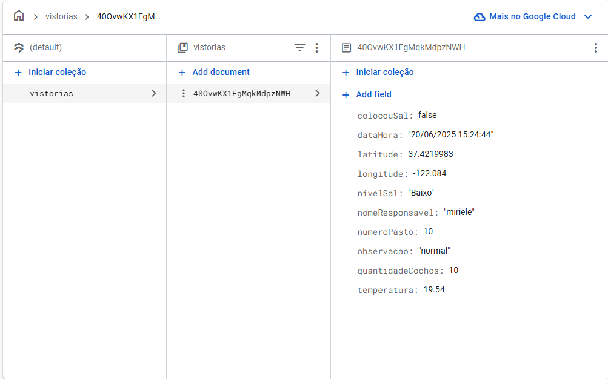
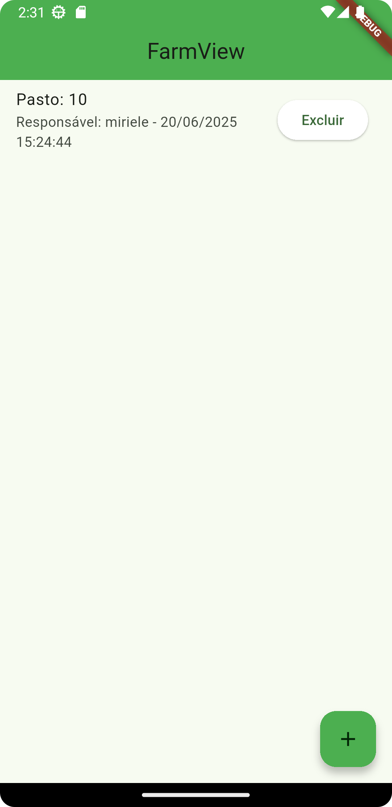
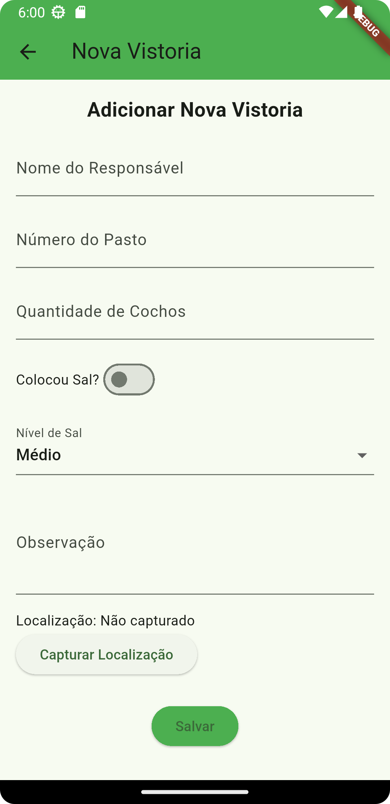
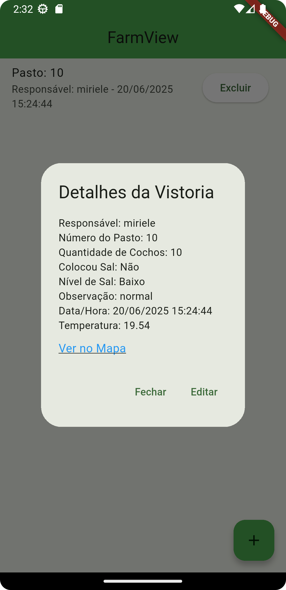
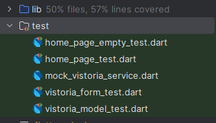

## App de Vistoria de Pasto

Aplicativo mobile desenvolvido para registrar, organizar e consultar vistorias em pastagens de forma prática e eficiente.

## Sobre Firebase Firestore

- Utilizado para salvar todas as vistorias e para traze-las para serem mostradas na tela Home.

<h3> Lista de Vistorias no Firestore</h3>

## Capturas de Tela da aplicação

<h3> Lista de Vistorias</h3>

<h3> Cadastro de Vistoria</h3>

<h3> Mapa com Edição</h3>

## Sobre package

- Criei um package responsavel por chamar uma api externa chamada  Open Weather que fornece á
aplicação a temperatura do local da vistoria.

- Na imagem onde mostra os detalhes de uma vistoria é possivel ver a temperatura sendo adicionada.

## Sobre testes

- A aplicação esta coberta por 57% de testes

<h3> Cobertura de testes</h3>

## Sobre Build
Fiz build apenas para Android, o arquivo apk se encontra na raiz do projeto.

